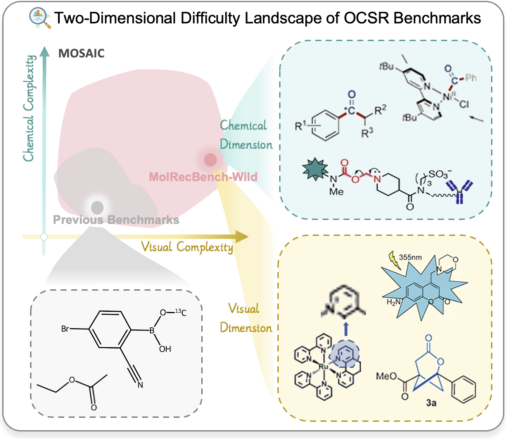

<p align="center">
  
</p>

<h1 align="center">U-MolRecBench-Wild</h1>

<p align="center">
  <b>A Real-World Benchmark for Optical Chemical Structure Recognition</b>
</p>

<p align="center">
  <a href="https://arxiv.org/abs/2511.02384"></a>
  <a href="https://huggingface.co/datasets/opendatalab/U-MolRecBench-Wild"></a>
  <a href="LICENSE"></a>
</p>


<p align="center">
  
</p>

## 🔥 News

- 🚀 [04/07/2026] Our paper is accepted by **CVPRF 2026**!

## ✨ Highlights
- 📊 **U-MolRecBench-Wild Dataset**: 5029 molecular structure graphs from 820 recent chemical papers.
- 🧩 **MOSAIC Framework**: The first dual-dimension (Visual Presentation + Chemical Semantics) difficulty assessment system with 37 fine-grained labels.
- 🧪 **CARBON Notation**: A novel molecular representation language capable of expressing valence changes, icon-based groups, and other non-standard chemical semantics.
- 📏 **Evaluation Toolkit**: A dual-track evaluation protocol supporting both CARBON and SMILES outputs.

## 📖 Table of Contents

- [Dataset Statistics](#dataset-statistics)
- [Quick Start](#quick-start)
  - [Step 1: Setup Environment](#step-1-setup-environment)
  - [Step 2: Setup VLMEvalKit](#step-2-setup-vlmevalkit)
  - [Step 3: Download & Convert Data](#step-3-download--convert-data)
  - [Step 4: Run Inference](#step-4-run-inference)
  - [Step 5: Convert Results](#step-5-convert-results)
  - [Step 6: Evaluation](#step-6-evaluation)
- [CARBON Notation](#carbon-notation)
- [Benchmark Results](#benchmark-results)

## Dataset Statistics

| Feature | MolRecBench-Wild | Traditional Benchmarks (e.g., USPTO, Staker) |
| :--- | :--- | :--- |
| **Source** | Academic Articles | Patents / Synthetic |
| **Sample Count** | 5029 | Varies (usually larger but simpler) |
| **Visual Difficulty Labels** | 18 Categories | < 10 Categories |
| **Chemical Difficulty Labels** | 24 Categories (MOSAIC subset) | < 3 Categories |
| **Ground Truth** | CARBON, Graph, SMILES | SMILES, MolFile |
| **Complex Structure Support** | Non-standard bonds, icon groups, mixed valences | Standard structures only |

## Quick Start

### Step 1:  Setup Environment

```bash
git clone https://github.com/your-username/MolRecBench-Wild.git
cd MolRecBench-Wild

# Install dependencies
conda create -n molrec python=3.10 -y
pip install -r requirements.txt
```

### Step 2: Setup VLMEvalKit

We use [VLMEvalKit](https://github.com/open-compass/VLMEvalKit) as the inference backend, with minimal patches to add chemistry-specific model adapters and datasets. Our patches are provided in [`patches/`](./patches/) for full transparency — we do not redistribute VLMEvalKit itself.

Run the one-click setup script:

```bash
bash setup_vlmevalkit.sh
```

After setup, create a file named ".env" in the VLMEvalKit directory and configure your API keys:

```bash
# VLMEvalKit/.env
OPENAI_API_BASE=https://your-api-base-url
OPENAI_API_KEY=your-api-key
```

### Step 3: Download & Convert Data

Download the dataset from HuggingFace and convert it to VLMEvalKit TSV format in one step:

```bash
# Defaulit: download all tracks data
python download_and_convert.py --prompt all             # generate TSV for all three tracks

# Download dataset and convert to SMILES track TSV
python download_and_convert.py --prompt smiles

python download_and_convert.py --prompt smiles --skip-download  # skip download if dataset/ already exists
```

The script will:
1. Download images to `./dataset/images/` and save ground truth to `./dataset/annotation.jsonl`
2. Generate TSV files to `./LMUData/`
3. Automatically register the `LMUData` path in `VLMEvalKit/.env` so VLMEvalKit can find the TSV files

### Step 4: Run Inference

```bash
cd VLMEvalKit

# Single-GPU / API model
python run.py --data chem_smiles --model GPT4o_20241120 --mode infer

# Multi-GPU (auto-detect)
bash scripts/run.sh --data chem_smiles --model GPT4o_20241120 --mode infer

# SLURM cluster
bash scripts/srun.sh <partition> --data chem_graph_simple --model InternVL3.5-241B-A28B-API --mode infer
```

**Key arguments:**

| Argument | Description |
| :--- | :--- |
| `--data` | Dataset name, matching the TSV filename under `~/LMUData/` (without `.tsv`) |
| `--model` | Model name as defined in `vlmeval/config.py` |
| `--mode` | `infer` (inference only), `eval` (evaluation only), or `all` (both) |
| `--work-dir` | Output directory (default: `./outputs`) |
| `--api-nproc` | Number of parallel API calls (default: 4) |
| `--reuse` | Reuse existing prediction files to resume interrupted runs |

Prediction results will be saved to `VLMEvalKit/outputs/<model_name>/`.

### Step 5: Convert Results

VLMEvalKit outputs an XLSX file per run. Convert it to the JSONL format expected by the Evaluator:

```bash
# Convert XLSX → Evaluator JSONL
python convert_results.py VLMEvalKit/outputs/<model_name>/<result_file>.xlsx \
    -o results/<model_name>.jsonl
```

### Step 6: Evaluation

After inference, use the Evaluator to compute accuracy on three tracks. The Evaluator takes two JSONL files — ground truth and predictions — and performs molecular graph isomorphism comparison.

**Evaluation metrics:**

| Metric | What it compares | Description |
| :--- | :--- | :--- |
| **SMILES Accuracy** | Canonical SMILES strings | Converts both GT and prediction to SMILES with superatom handling, then compares canonical forms |
| **Simplified Graph Accuracy** | Atom symbols + bond types | Graph isomorphism on simplified molecular graph (ignoring charges, radicals, valences, isotopes) |
| **Graph Accuracy** | Full CARBON attributes + brackets | Graph isomorphism on the complete molecular graph including all attributes and bracket structures |

**Running evaluation:**

```bash
python evaluate/eval_SMILES.py --gt_path dataset/annotation.jsonl --pred_path results_origin_jsonl/GPT4o_20241120/GPT4o_20241120_chem_smiles.jsonl
# Output:
# SMILES Precision: 0.0797

python evaluate/eval_S_GRAPH.py --gt_path dataset/annotation.jsonl --pred_path results_origin_jsonl/GPT4o_20241120/GPT4o_20241120_chem_graph_simple.jsonl
# Output:
# Simplified Graph Precision: 0.0374

python evaluate/eval_GRAPH.py --gt_path dataset/annotation.jsonl --pred_path results_origin_jsonl/GPT4o_20241120/GPT4o_20241120_chem.jsonl
# Output:
# SMILES Precision          : 0.0
# Simplified Graph Precision: 0.0344
# Graph Precision           : 0.0298
```

The `--save_path` option saves per-sample evaluation details to a JSON file for further analysis.

## CARBON Notation

CARBON (Complex Atomic Representation and Bonding Object Notation) is a core innovation of this project, designed to address the shortcomings of existing representation methods in expressing complex chemical semantics.
It supports:
Non-standard Bond Types: Dashed bonds, bold bonds, mixed bond orders, etc.
Rich Atomic Properties: Oxidation states, radicals, isotopes, non-integer charges.
Repeating Structures: Explicit representation of polymers and repeating units.
Spatial Coordinates: Retains image-level 2D coordinate information.
Example (JSON Format):

```json
{
  "atoms": [
    {"id": 0, "atom": "O", "point_2d": [9.0, -8.0]},
    {"id": 1, "atom": "S", "point_2d": [9.0, -9.1]},
    {"id": 2, "atom": "CF3", "point_2d": [9.5, -9.9]}, 
    {"id": 4, "atom": "Rα", "point_2d": [8.0, -9.1]} 
  ],
  "bonds": [
    {"atom1": 0, "atom2": 1, "bond_type": "double"},
    {"atom1": 1, "atom2": 4, "bond_type": "any"} 
  ]
}
```


## Benchmark Results

We evaluated 18 mainstream models, revealing that existing methods suffer significant performance drops in real-world scenarios.

| Model Category | Model Name | SMILES Acc (%) | Simplified Graph Acc (%) | Graph Acc (%) |
| :--- | :--- | :--- | :--- | :--- |
| Expert (Graph) | GTR-Mol-VLM | 33.32 | 32.66 | - |
| Expert (Graph) | MolScribe | 28.11 | 32.35 | - |
| VLM | Gemini 2.5 Pro | 27.50 | 15.58 | 12.50 |
| VLM | InternVL3.5 | 24.39 | 6.83 | 3.73 |
| Expert (SMILES) | DECIMER v2.2 | 20.27 | - | - |
| Tool | Mathpix | 27.32 | - | - |

Please refer to the paper for complete results.


<!-- ## Citation

If you use MolRecBench-Wild, the MOSAIC framework, or the CARBON notation in your research, please cite our paper:

```bibtex
@inproceedings{anonymous2026molrecbench,
  title={MolRecBench-Wild: A Real-World Benchmark for Optical Chemical Structure Recognition},
  author={Anonymous CVPR Submission},
  booktitle={Proceedings of the IEEE/CVF Conference on Computer Vision and Pattern Recognition (CVPR)},
  year={2026}
}
``` -->

<!-- ## Acknowledgements
We thank all domain experts who participated in data annotation and verification. -->
