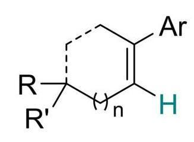

<p align="center">
  
</p>

<h1 align="center">MolRecBench-Wild</h1>

<p align="center">
  <b>A Real-World Benchmark for Optical Chemical Structure Recognition</b>
</p>

<p align="center">
  <a href="https://arxiv.org/abs/2511.02384"></a>
  <a href="https://huggingface.co/datasets/opendatalab/MolRecBench-Wild"></a>
  <a href="LICENSE"></a>

</p>

<p align="center">
  <a href="README.md">🇬🇧 English</a>
</p>

<p align="center">
  
</p>

## 🔥 News

- 🚀 [04/07/2026] 论文被CVPRF接收!

## 📊 数据集统计

| Feature | MolRecBench-Wild | Traditional Benchmarks (e.g., USPTO, Staker) |
| :--- | :--- | :--- |
| **Source** | Academic Articles | Patents / Synthetic |
| **Sample Count** | 5029 | Varies (usually larger but simpler) |
| **Visual Difficulty Labels** | 18 Categories | < 10 Categories |
| **Chemical Difficulty Labels** | 19 Categories (MOSAIC subset) | < 3 Categories |
| **Ground Truth** | CARBON, Graph, SMILES | SMILES, MolFile |
| **Complex Structure Support** | Non-standard bonds, icon groups, mixed valences | Standard structures only |


## CARBON 数据格式

<p align="center">
  
</p>


```json
{
  "symbols": ["[R]", "C", "[R']", "C", "C", "H", "C", "[Ar]", "C", "C"], 
  "charges": [null, null, null, null, null, null, null, null, null, null], 
  "radicals": [null, null, null, null, null, null, null, null, null, null], 
  "valences": [null, null, null, null, null, null, null, null, null, null], 
  "isotopes": [null, null, null, null, null, null, null, null, null, null], 
  "attach_points": [null, null, null, null, null, null, null, null, null, null], 
  "coords": [
      [10.8075, -9.3566], 
      [11.7673, -9.3302], 
      [11.4253, -10.2699], 
      [12.6333, -9.8302], 
      [13.4993, -9.3302], 
      [14.3654, -9.8302], 
      [13.4993, -8.3302], 
      [14.3654, -7.8302], 
      [12.6333, -7.8302], 
      [11.7673, -8.3302]
    ], 
  "bonds": [
      [0, 1, 1], 
      [1, 2, 1], 
      [1, 3, 1], 
      [1, 9, 7], 
      [3, 4, 1], 
      [4, 5, 1], 
      [4, 6, 2], 
      [6, 7, 1], 
      [6, 8, 1], 
      [8, 9, 7]
    ], 
  "brackets": [
      {
        "alias": "n", 
        "atoms": [3], 
        "display_rects": [
            [11.9503, -10.0132, 12.4503, -9.1472], 
            [12.8163, -9.1472, 13.3163, -10.0132]
          ]
      }
      ]
}
```

## ⚡ 快速开始

### 第一步:  环境安装

```bash
git clone https://github.com/your-username/MolRecBench-Wild.git
cd MolRecBench-Wild

# 创建虚拟环境
conda create -n molrec python=3.10 -y
# 安装依赖
pip install -r requirements.txt
```

### 第二步: 配置 VLMEvalKit

我们使用 [VLMEvalKit](https://github.com/open-compass/VLMEvalKit) 进行模型推理，并进行了最小化修改，以添加面向化学任务的模型适配器和数据集。所有修改均在 [`patches/`](./patches/) 目录中提供以确保完全透明——我们不会重新分发 VLMEvalKit 本身。

运行一键安装脚本:

```bash
bash setup_vlmevalkit.sh
```

之后，在 VLMEvalKit 目录下创建一个名为 “.env” 的文件，并配置你的 API 密钥：

```bash
# VLMEvalKit/.env
OPENAI_API_BASE=https://your-api-base-url
OPENAI_API_KEY=your-api-key
```

### 第三步: 下载并转换数据集

从 HuggingFace 下载数据集，并一步将其转换为 VLMEvalKit 的 TSV 格式：

```bash
# 默认: 下载数据集，并转换成所有需要的格式，包括用于仅预测SMILES的推理格式，预测简化图的推理格式，以及预测图的推理格式
python download_and_convert.py --prompt all             # generate TSV for all three tracks

# 下载数据集，并转成金预测SMILES的推理格式
python download_and_convert.py --prompt smiles

# 如果数据集已经下载，可以通过 skip-download 参数来仅转换格式
python download_and_convert.py --prompt smiles --skip-download
```

这个脚本会进行如下操作:
1. 下载数据集到 `./dataset/images/` 并且保存标注信息到 `./dataset/annotation.jsonl`
2. 生成 TSV 文件保存到 `./LMUData/`
3. 自动在 `VLMEvalKit/.env` 中注册 `LMUData` 路径，以便 VLMEvalKit 能够找到这些 TSV 文件。

### 第四步: 运行推理脚本

```bash
cd VLMEvalKit

# 一次推理一个任务 (SMILES)
python run.py --data smiles --model GPT4o_20241120

# 一次推理三个任务 (SMILES, Simplified Graph, Graph)
python run.py --data smiles simple_graph carbon --model GPT4o_20241120

# 使用并行API调用来提高推理速度
python run.py --data smiles --model GPT4o_20241120 --api-nproc 32

# 恢复一个中断的运行（跳过已完成的样本）
python run.py --data smiles --model GPT4o_20241120 --reuse
```

**关键参数:**

| 参数 | 描述 |
| :--- | :--- |
| `--data` | 要运行的识别任务：SMILES、简化图（Simplified Graph）或图（Graph） |
| `--model` | `vlmeval/config.py`中定义的模型名称 |
| `--work-dir` | 输出文件夹 (default: `./outputs`) |
| `--api-nproc` | 并行 API 调用的数量（默认值为 4，可增大以加快推理速度） |
| `--reuse` | 复用已有的预测文件以恢复中断的运行 |

预测结果将会被保存在 `VLMEvalKit/outputs/<model_name>/`.

**测试你自己的模型:**

要评估自定义模型，你需要在 VLMEvalKit 中实现一个模型封装（wrapper）。至少需要创建一个包含 `generate_inner(msgs, dataset=None)` 方法的类，该方法接收多模态消息列表并返回模型的预测字符串。随后，将该模型注册到 `vlmeval/config.py` 中。详细说明请参阅 [VLMEvalKit 开发指南](https://github.com/open-compass/VLMEvalKit/blob/main/docs/en/Development.md#implement-a-new-model)。

### 第五步: 转换预测结果格式

VLMEvalKit 每次运行都会输出一个 XLSX 文件。将其转换为 Evaluator 所需的 JSONL 格式：

```bash
# 将 XLSX 转换为 Evaluator 所需的 JSONL 格式
python convert_result.py \
    -i "VLMEvalKit/outputs/GPT4o_20241120/T20260413_G/GPT4o_20241120_chem_smiles.xlsx" \
    -o "results/GPT4o_20241120_chem_smiles.jsonl"
```

### 第六步: 评估

推理完成后，使用 Evaluator 在三个任务上计算准确率。
Evaluator 接收两个 JSONL 文件——标注信息（ground truth）和预测结果（predictions）。

**Evaluation metrics:**

| Metric | What it compares | Description |
| :--- | :--- | :--- |
| **SMILES 准确率** | SMILES字符串 | 将真实标签（GT）和预测结果都转换为带有超原子（superatom）处理的 SMILES 表示，然后比较其规范化（canonical）SMILES 字符串。 |
| **简化图准确率** | 原子符号和键类型 | 在简化的分子图上进行图同构判断（忽略电荷、自由基、价态、同位素、连接点和括号等信息）。|
| **图准确率** | 完整的CARBON信息 | 在完整的分子图上进行图同构判断，包括所有属性信息。|

**运行评估命令:**

```bash
python evaluate/eval_SMILES.py --gt_path dataset/annotation.jsonl --pred_path results/GPT4o_20241120_chem_smiles.jsonl
# 输出:
# SMILES Precision: 0.0797

python evaluate/eval_S_GRAPH.py --gt_path dataset/annotation.jsonl --pred_path results/GPT4o_20241120_chem_graph_simple.jsonl
# 输出:
# Simplified Graph Precision: 0.0374

python evaluate/eval_GRAPH.py --gt_path dataset/annotation.jsonl --pred_path results/GPT4o_20241120_chem.jsonl
# 输出:
# SMILES Precision          : 0.0
# Simplified Graph Precision: 0.0344
# Graph Precision           : 0.0298
```

## 基准测试结果

我们评估了 18 个主流模型，结果表明现有方法在真实世界场景中存在显著的性能下降。
带下划线的数值表示各类别中的最佳结果，加粗数值表示所有类别中的总体最佳结果。

| Method | SMILES | Simplified Graph | Graph |
|--------|--------|------------------|-------|
| **基于 SMILES 的专家模型** |||| 
| OCSU | 6.06 | - | - |
| DECIMERv2.2 | 22.84 | - | - |
| **基于图的专家模型** |||| 
| MolGrapher | 20.33 | 22.81 | - |
| MolNexTR | 40.9 | 34.42 | - |
| MolScribe | 41.05 | 34.74 | - |
| GTR-Mol-VLM | 40.43 | 35.22 | - |
| **视觉语言模型** |||| 
| GPT-4o | 7.94 | 3.74 | 2.94 |
| Qwen-VL-Max |6.95 | 5.83 | 3.66 |
| InternVL3.5 | 25.6 | 6.88 | 3.08 |
| ChemVLM† | 4.79 | - | - |
| ChemDFM-X† | 9.75 | - | - |
| **视觉推理模型** |||| 
| GPT-5 | 19.68 | 10.0 | 8.19 |
| Seed1.6-Thinking | 15.6 | 7.14 | 4.61 |
| Intern-S1 | 18.98 | 6.62 | 3.46 |
| Gemini 2.5 Pro | 30.06 | 15.67 | 13.04 |
| GLM-4.5V | 12.13 |7.89 | 4.26 |
| **工具** |||| 
| Mathpix | 27.88 | - | - |
| Logics-Parsing | 15.47 | - | - |

完整结果请参阅论文。


<!-- ## Citation

If you use MolRecBench-Wild, the MOSAIC framework, or the CARBON notation in your research, please cite our paper:

```bibtex
@inproceedings{anonymous2026molrecbench,
  title={MolRecBench-Wild: A Real-World Benchmark for Optical Chemical Structure Recognition},
  author={Anonymous CVPR Submission},
  booktitle={Proceedings of the IEEE/CVF Conference on Computer Vision and Pattern Recognition (CVPR)},
  year={2026}
}
``` -->
